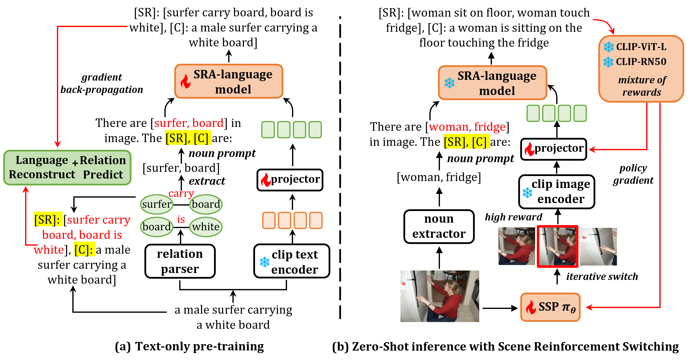

## Visual-Language Scene-Relation-Aware Zero-Shot Captioner 

**Authors**: Qianyue Bao, Fang Liu, Licheng Jiao, Yang Liu, Shuo Li, Lingling Li, Xu Liu, Puhua Chen 

official implementation of SRACap. 

## Introduction

In this paper, we propose a scene-relation-level pre-training task by considering relations as more valuable modal connection bridges. Based on this, we construct a novel Visual-Language Scene Relation Aware Captioner (SRACap), which expands the ability to predict scene relations while generating captions for images. In addition, SRACap possesses excellent cross-domain zero-shot generalization capability, which is driven by a well-designed scene reinforcement switching pipeline. We introduce a scene policy network to dynamically crop salient regions from images and feed them into a language model to generate captions. We integrate multiple expert CLIP models to form a mixture-of-rewards module (MoR) as a reward source, and deeply optimized SRACap through the policy gradient algorithm in the zero-shot inference stage. With the iteration of scene reinforcement switching, SRACap can gradually refine the generated caption details while maintaining high semantic consistency across visual-linguistic modalities. 

<div align = center>

</div>

<div align = center>

</div> 

## To-Do List 

- [x] Data preparation code 
- [x] Train language model code 
- [ ] SRACap Inference code 
- [ ] Code for Zero-Shot Inference based on Scene Reinforcement Switching


## Environment Preparation 

```
conda create -n SRACap python=3.8
conda install pytorch==2.0.0 torchvision==0.15.0 torchaudio==2.0.0 pytorch-cuda=11.8 -c pytorch -c nvidia
pip install -r requirements.txt
```

## Pre-trained Model  

Create `pretrained/` path in the project root directory and put the following model into `pretrained/`

* [CLIP-ViT-B/32](https://openaipublic.azureedge.net/clip/models/40d365715913c9da98579312b702a82c18be219cc2a73407c4526f58eba950af/ViT-B-32.pt) 
* [CLIP-ViT-L/14](https://openaipublic.azureedge.net/clip/models/40d365715913c9da98579312b702a82c18be219cc2a73407c4526f58eba950af/ViT-B-32.pt) 
* [flan-t5-base-VG-factual-sg](https://huggingface.co/lizhuang144/flan-t5-base-VG-factual-sg) 
* [gpt2](https://huggingface.co/openai-community/gpt2) 


## Data Preparation  

```
├── annotaions
│   │
│   ├──cc3m
│   │   ├──cc3m_train.json
│   │   ├──cc3m_with_entities_sr.pickle
│   │   ├──cc3m_texts_sr_features_ViT-B32.pickle
│   │       
│   ├──coco
│   │   ├──train_captions.json
│   │   ├──test_captions.json
│   │   ├──val_captions.json
│   │   ├──val2014/
│   │   ├──coco_with_entities_sr.pickle
│   │   ├──coco_texts_sr_features_ViT-B32.pickle
│   │       
│   ├──nocaps
│   │   ├──new_nocaps_corups.json
│   │   ├──nocaps_val_4500_captions.json
│   │   ├──images/val/
...
```

1.First of all, you need to download the dataset and pre-trained models.

+ CC3M  
    - [CC3M annotations-files](https://drive.google.com/file/d/1cLbMOsH8dSQYzszYmIIFDiOAn-I5paRK/view?usp=drive_link) 


+ COCO 

    - [COCO2014 images](https://github.com/salesforce/LAVIS/blob/main/dataset_card/coco_caption.md) (only Val Set)  
    - [COCO2014 annotations-files](https://drive.google.com/drive/folders/1ycIVkLqVAhdVZj28Rje3Tyt3Uvb3iV1V?usp=drive_link) 


+ NoCaps 

    - [NoCaps images](https://nocaps.org/download) (only Validation Set)  
    - [NoCaps annotations-files](https://drive.google.com/drive/folders/1Qvw97HCvwW3bHIGpm8vZRLqFIO2Q_ToT?usp=drive_link) 

2.Then, use the following code to extract the corresponding scene relation triples sets for each dataset. 
Before running, modify the `idx` in the main function to select different datasets.

```
python entities_sr_extraction.py 
```  

3.Run the following code to extract the text feature set of each data set and store it in pickle format. 
Before running, modify the `idx` in the main function to select different datasets.

```
python texts_features_extraction.py 
```  


## Train 

To train SRACap on the CC3M or the COCO dataset, using the following script (bash train_*.sh n), respectively: 

```
cd scripts/
bash train_cc3m.sh 0
bash train_coco.sh 0
```
where `n` represents the ID of gpu used (i.e., 'cuda:n').


## Acknowledgments
Our repository builds on [CLIP](https://github.com/openai/CLIP), [ClipCap](https://github.com/rmokady/CLIP_prefix_caption), [ViECap](https://github.com/FeiElysia/ViECap), [RLCF](https://github.com/mzhaoshuai/RLCF), [MeaCap](https://github.com/joeyz0z/MeaCap) repositories. Thanks for open-sourcing!