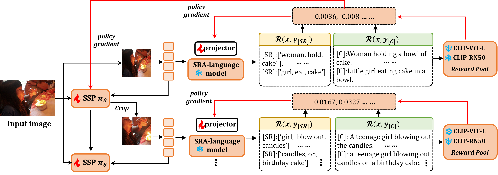

## Visual-Language Scene-Relation-Aware Zero-Shot Captioner 

official implementation of SRACap.

## Introduction

Zero-shot image captioning can harness the knowledge of pre-trained visual language models (VLMs) and language models (LMs) to generate captions for target domain images without paired sample training. Existing methods attempt to establish high-quality connections between visual and textual modalities in text-only pre-training tasks. These methods can be divided into two perspectives: sentence-level and entity-level. Although they achieve effective performance on some metrics, they suffer from hallucinations due to biased associations during training. In this paper, we propose a scene-relation-level pre-training task by considering relations as more valuable modal connection bridges. Based on this, we construct a novel Visual-Language Scene Relation Aware Captioner (SRACap), which expands the ability to predict scene relations while generating captions for images. In addition, SRACap possesses excellent cross-domain zero-shot generalization capability, which is driven by a well-designed scene reinforcement switching pipeline. We introduce a scene policy network to dynamically crop salient regions from images and feed them into a language model to generate captions. We integrate multiple expert CLIP models to form a mixture-of-rewards module (MoR) as a reward source, and deeply optimized SRACap through the policy gradient algorithm in the zero-shot inference stage. With the iteration of scene reinforcement switching, SRACap can gradually refine the generated caption details while maintaining high semantic consistency across visual-linguistic modalities. We conduct extensive experiments on multiple standard image captioning benchmarks, showing that SRACap can accurately understand scene structures and generate high-quality text, significantly outperforming other zero-shot inference methods.  

<div align = center>

</div>

<div align = center>

</div> 


## Environment Preparation 

```
conda install pytorch==2.0.0 torchvision==0.15.0 torchaudio==2.0.0 pytorch-cuda=11.8 -c pytorch -c nvidia

pip install transformers==4.19.2
scikit-learn
scikit-image
```

## Data Preparation


## Train 


## Eval 


## Acknowledgments
Our repository builds on [CLIP](https://github.com/openai/CLIP), [ClipCap](https://github.com/rmokady/CLIP_prefix_caption), [ViECap](https://github.com/FeiElysia/ViECap), [RLCF](https://github.com/mzhaoshuai/RLCF), [MeaCap](https://github.com/joeyz0z/MeaCap) repositories. Thanks for open-sourcing!